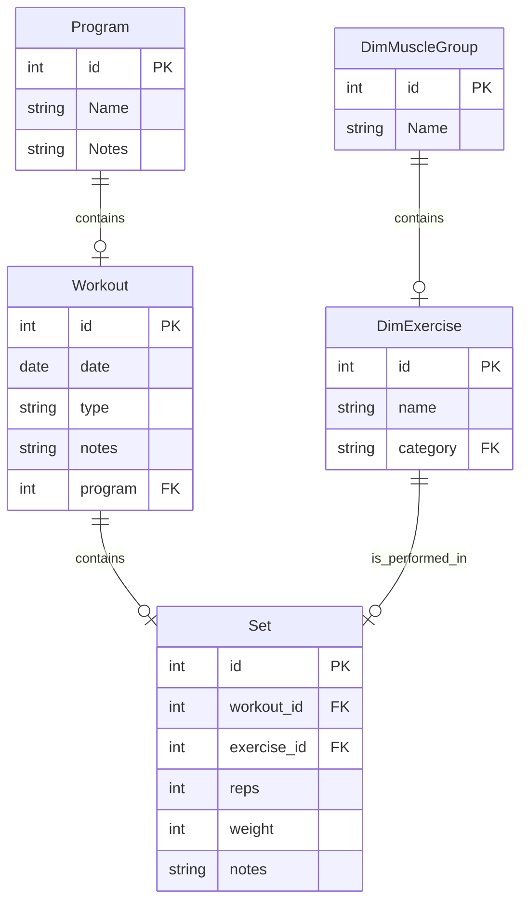

## Structure

```mermaid

erDiagram

    DimMuscleGroup {
        int id PK
        string Name
    }

    DimExercise {
        int id PK
        string name
        string category FK
    }

    Program {
        int id PK
        string Name
        string Notes
    }
    Workout {
        int id PK
        date date
        string type
        string notes
        int program FK
    }
    Set {
        int id PK
        int workout_id FK
        int exercise_id FK
        int reps
        int weight
        string notes

    }

    Program ||--o| Workout : contains
    Workout ||--o| Set : contains
    DimMuscleGroup ||--o| DimExercise : contains
    DimExercise ||--o| Set : is_performed_in
```
